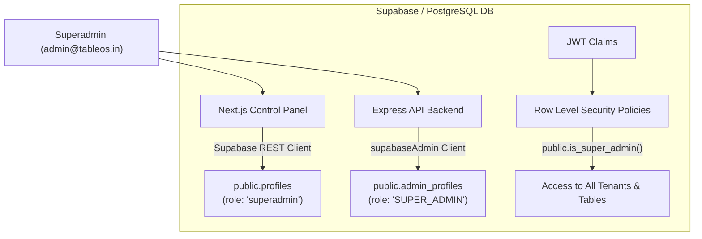

# TableOS Superadmin Architecture & Identity Details

This document provides a comprehensive, deep-dive architectural review of the **Superadmin** capabilities, schemas, identity mapping, database policies, and Next.js control panel structure on the `tableos` platform.

---

## 1. Current Superadmin Identity Details

The platform utilizes a dedicated superadmin identity for system administration, tenant onboarding, diagnostics, and global telemetry monitoring.

### Database Records & Metadata

Below is the verified record snapshot of the current active superadmin across the database schema:

| Parameter | Auth Layer (`auth.users`) | App Dashboard Layer (`public.profiles`) | Database Core Layer (`public.admin_profiles`) |
| :--- | :--- | :--- | :--- |
| **ID (UUID)** | `35d5e983-d0fc-4434-b578-a15997550ae4` | `35d5e983-d0fc-4434-b578-a15997550ae4` | `35d5e983-d0fc-4434-b578-a15997550ae4` |
| **Email** | `admin@tableos.in` | `admin@tableos.in` | *(Binds to auth.users.email)* |
| **Role Name** | `authenticated` | `superadmin` | `SUPER_ADMIN` |
| **Tenant ID** | *N/A* | `11111111-1111-1111-1111-111111111111` | `null` *(Global Platform Context)* |
| **Full Name** | *N/A* | `Admin` | `System Admin` |
| **Is Active** | *N/A* | `true` | `true` |
| **Account Status** | Confirmed | Normal | Unlocked (`is_locked = false`) |
| **Created At** | `2026-04-04T05:23:20Z` | `2026-04-04T05:23:20Z` | `2026-05-13T16:59:46Z` |
| **Last Login** | `2026-05-29T15:25:51Z` | *(Binds to auth)* | `null` *(Bypasses legacy logging)* |

> [!NOTE]
> The superadmin has no direct restaurant tenant binding. In `admin_profiles`, the `tenant_id` is set to `null` to ensure global access. In the Next.js `profiles` table, a mock UUID `11111111-1111-1111-1111-111111111111` is assigned to satisfy multi-tenant dashboard query structures without triggering schema violations.

---

## 2. Dual-Role Architecture Mapping

The platform handles authorization through a **dual-role strategy** that spans across the presentation and core data layers:



### 1. SQL Database Layer (`admin_profiles` table)
- **Role Type**: Native Postgres Custom Enum (`public.admin_role`).
- **Identifier**: `SUPER_ADMIN`.
- **Constraint**: Evaluated via a strict database check constraint:
  ```sql
  CONSTRAINT chk_super_admin_no_tenant CHECK (role != 'SUPER_ADMIN' OR tenant_id IS NULL)
  ```
  This constraint ensures that any identity marked as `SUPER_ADMIN` cannot be associated with a specific tenant id.

### 2. Next.js Web App Layer (`profiles` table)
- **Role Type**: TEXT column matching string `'superadmin'`.
- **Primary Use**: Validated in Next.js Server Components, API routes (`/api/dashboard/metrics`), and client-side page layouts (`src/app/dashboard/layout.tsx`) to authorize access to system controls.

---

## 3. Row Level Security (RLS) & JWT Authorization

Superadmin authorization is tightly integrated with PostgreSQL Row Level Security (RLS) to permit global reads and modifications while locking down individual restaurant tenant workspaces from each other.

### 1. The `is_super_admin()` Security Function
A utility function is defined globally within the PostgreSQL database (`public.is_super_admin()`) to detect if the querying JWT belongs to the system superadmin:
```sql
CREATE OR REPLACE FUNCTION public.is_super_admin()
RETURNS BOOLEAN SECURITY DEFINER AS $$
BEGIN
  RETURN (current_setting('request.jwt.claims', true)::jsonb -> 'app_metadata' ->> 'rbac_role') = 'SUPER_ADMIN';
END;
$$ LANGUAGE plpgsql;
```

### 2. RLS Bypass Rules
Most application tables use RLS to scope queries to the current tenant (`public.current_tenant_id()`). Superadmins bypass this scoping rule in standard SQL policies:

- **Tenants Table (`public.tenants`)**:
  - `SELECT`: Allowed for superadmin or the tenant itself.
  - `INSERT/UPDATE`: **Superadmin exclusive**. Only superadmins may create new restaurant nodes.
  ```sql
  CREATE POLICY "Superadmins can manage tenants" ON public.tenants
    FOR ALL
    USING (public.is_super_admin() OR id = public.current_tenant_id())
    WITH CHECK (public.is_super_admin());
  ```
- **Branches, Menus, Tables, and Operational Entities**:
  - Standard operational tables contain security policies that grant automatic read/write bypass access if `public.is_super_admin()` returns `true`:
  ```sql
  CREATE POLICY "Allow read for superadmin or tenant users" ON public.branches
    FOR SELECT USING (public.is_super_admin() OR tenant_id = public.current_tenant_id());
  ```

---

## 4. Next.js Dashboard Architecture (`tableos/superadmin`)

The superadmin controls are consolidated into a dedicated, rich dark-themed Next.js control center app.

### Core Architecture Components

The application structure inside `tableos/superadmin/src/app` includes:

1. **Dashboard Entrypoint (`/dashboard`)**:
   - Real-time telemetry monitoring.
   - Live vitals checks (`/api/health`) verifying Database, Orders, Auth, and Storage latency in 30s intervals.
   - Plan tier segmentation charts (Starter, Pro, and Enterprise) displaying aggregate platform composition.
2. **Tenant Control Panel (`/dashboard/tenants`)**:
   - Node status tracking (Active, Trial, Suspended).
   - MRR (Monthly Recurring Revenue) trajectory analytics, plan tier settings, and system-level configuration parameters.
3. **Onboarding Pipeline Trigger (`/dashboard/onboard`)**:
   - Setup state tracker for categories, items, tax profiles, tables, staff, and kitchen stations.
4. **Broadcast Core (`/dashboard/broadcast`)**:
   - Multi-surface live notifications to push maintenance alerts, version updates, or terminal commands across all tablet, KDS, and waiter-wearable surfaces.
5. **Diagnostics Engine (`/dashboard/diagnostics`)**:
   - Schema validation tool comparing local migrations against remote database schema cache to resolve missing database tables or missing schema cache relationships (such as bypassing missing tables dynamically).
